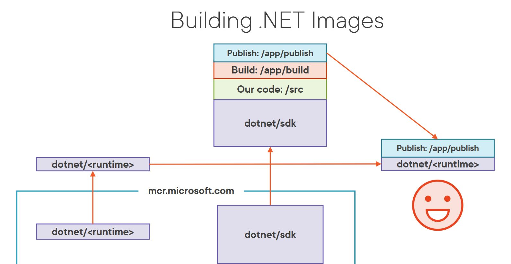

# Developing .NET Core 5 Apps with Docker

This course is about developing .NET Core 5 apps with Docker.

## Getting Started with .NET Core and Docker

Basic introduction to .NET Core and Docker.

It is pretty easy to add Docker support to a .NET Core project, especially if you use Visual Studio or VS Code (remember to use extensions).

As for the Docker documentation, it is pretty good, so use it whenever you need to. You can find it [here](https://docs.docker.com/).

## Logging in Docker-based .NET Core Apps

Logging in containers:

- key success factor: enable understanding and ease-of-use, then get on with app,
- console is key: troubleshooting is made easy by console logging,
- analysis matters: get logs into a store that supports analysis and exploration.

Level up with Serilog:

- logging libraries provide benefits:
  - structured logging,
  - wide variety of "sinks" (targets),
  - enrichers (add context to log events),
  - filters (control what gets logged),
- Serilog is leading the pack:
  - NLog and Log4Net are also popular.

Log vs ILogger:

- `ILogger` is a standard interface injected into classes that need to log (this way we can swap the implementation),
- (Serilog) `Log` is a static class that wraps ILogger (no need to perform dependency injection but changing the implementation is more difficult).

Tip for VSCode, we can hide "bin", "obj" and "node_modules" folders in the Explorer view. To do so, open the Command Palette (Ctrl+Shift+P) and type "settings" and select "Preferences: Open Settings (JSON)". Then add the following line:

```json
"files.exclude": {
    "**/.git": true,
    "**/.svn": true,
    "**/.hg": true,
    "**/CVS": true,
    "**/.DS_Store": true,
    "**/bin": true,
    "**/obj": true,
    "**/node_modules": true
}
```

Or just enter Ctrl+, to open the settings.json file, then look for "hide", and you will find the option to hide the folders (for the current workspace or for the user).

## Configuration in Docker-based .NET Core Apps

Types of configuration:

- environment-specific: URLs, server names, non-secret values,
- secrets: passwords, API keys, connection strings, license keys, etc.,
- runtime "knobs": things you don't want hard-coded (feature toggles?) - very subjective.

Layered configuration:

- appsettings.json: json-based text file,
- appsettings.{environment}.json: json-based text file, based on ASPNETCORE_ENVIRONMENT,
- user secrets: development only, not checked into source control,
- environment variables: set by the OS, can be set in Dockerfile,
- command-line arguments: set by the OS, can be set in Dockerfile.

Containers like environment variables: containers are immutable - build one image to run anywhere.

Typical approach:

- app settings with environment variables,
- eliminates env-specific appsettings files,
- leverage container capabilities,
- load secrets during runtime if needed.

Protect your secrets:

- different approaches are available,
- apply as environment variables from secrets in pipeline,
  - consider who can see variables,
- read at runtime from a vault:
  - you still need to auth to the vault.

## Building Docker Images for .NET Core Apps




Process:

- set up base image with aspnetcore runtime,
- use full sdk as build stage,
- restore packages and build project,
- alias build as publish and run dotnet publish,
- copy publish files into final image with just the runtime on it.

Great if the above process is automated, so we can build and push images to a registry automatically (for example with the help of GitHub Actions).

[Container fast mode](https://itnext.io/understanding-the-visual-studio-docker-fastmode-integration-c0bccc08b8f9) (VS & VSCode):

- first stage pulled/built,
- volumes mapped for source, debugger, packages, SSL, secrets.

We can disable fast mode or build for Release.

## Simplify Complex Solutions with Docker Compose

Docker Compose:

- container orchestration tool,
- "define and share multi-container apps",
- simplify what we need to keep track of,
- developer set-up (and tear-down) is easy!

Traditional setup vs. Docker Compose.

| Traditional                             | Docker Compose                   |
| --------------------------------------- | -------------------------------- |
| Get source code                         | Get source code                  |
| Find way to run Seq                     | Run solution (docker-compose up) |
| Find way to run SQL Server              | -                                |
| Run database setup/initial data scripts | -                                |
| Find way to run RabbitMQ                | -                                |
| Verify connection strings               | -                                |
| Verify website setup                    | -                                |
| Run solution (set startup projects)     | -                                |

SQL in Docker Compose:

- startup is a challenge,
- wait for it to be started and listening then run setup logic,
- use custom Dockerfile and entrypoint logic.

Sample App (Carved Rock) Architecture


Visual Studio & VS Code booth have Docker Compose support.

Now you are ready to start developing .NET Core 5 apps with Docker :-).
