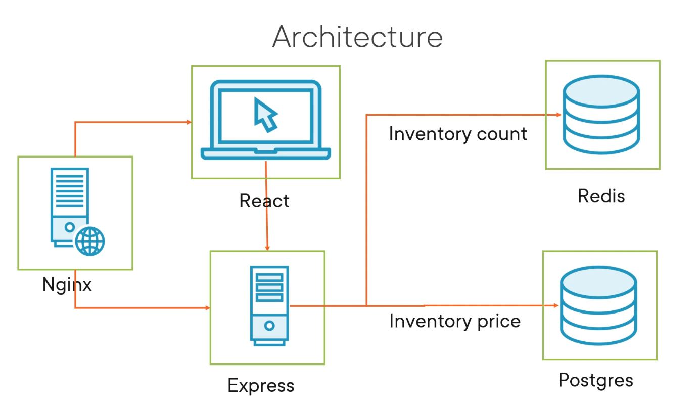

# Developing React Apps with Docker

This course is about developing React apps with Docker.

## Dockerizing a Basic React App

Original sample code can be found [here](https://github.com/saravanan75/docker_react).

Scenario:

- the company Globomantics is growing, but as it grows, it is becoming more difficult to manage the development and deployment of its applications,
- they are using (at the moment) a single monolithic application that is deployed to a single server,
- current setup is reaching its limits, and current performance metrics are barely meeting SLAs expectations,
- the company decided to hire a consultant to help them with the transition to a microservices architecture,
- part of that switch would be to use Docker to containerize the applications.

To build the image, run the following command (inside "v1\Globomantics" directory):

```cmd
docker build -f .\Dockerfile -t sswietoniowski/globomantics .
```

To run the container, run the following command:

```cmd
docker run -d -p 3000:3000 --name globomantics sswietoniowski/globomantics
```

We must change Vite configuration to make it work with Docker. To do that, we need to add the following line to the `vite.config.js` file:

```javascript
server: {
  host: true, // THIS IS CRITICAL!
  port: 3000,
}
```

Questions to answer:

- how to reduce the build time?
- what is the IP address provided by the Docker run?
- why I can't access the application from the browser (at localhost:3000)?

To reduce the build time, we can use `.dockerignore` file to exclude files and directories from the build context. Sample content of the file:

```text
node_modules
.git
.vscode
```

To expose the application to the host machine, we need to use the following command:

```cmd
docker run -d -p 3000:3000 --name globomantics sswietoniowski/globomantics
```

Where `-p` is a port mapping option. It maps the port 3000 on the host machine to the port 3000 on the container.

## Building a Multi-container Application Using Docker Compose

Now we're trying to build a multi-container application using Docker Compose.

We would have the client application (React), an API server (Express) and a database (Redis) (the new version of the system can be found inside "v2\Globomantics" directory).

While configuring Express and using Vite and Nodemon you might find useful [this](https://dev.to/kevinqtogitty/how-to-set-up-an-express-server-with-typescript-and-es6-import-statements-using-vite-9l6) and [this](https://blog.logrocket.com/configuring-nodemon-with-typescript/) articles.

All commands run from the "v2\Globomantics" directory.

To establish a connection between the client, the API server and the database, we need to create a network. To do that, run the following command:

```cmd
docker network create globomantics
```

To run the database using Redis, just run the following command:

```cmd
docker run -d -p 6379:6379 --network globomantics --name redis redis
```

Alternatively, we could run the following command (to connect the database to the network):

```cmd
docker network connect globomantics redis
```

To run the API server, run the following command:

```cmd
docker build -f .\Api\Dockerfile -t sswietoniowski/globomantics-api .\Api
```

```cmd
docker run -d -p 3001:3001 --network globomantics --name globomantics-api sswietoniowski/globomantics-api
```

Finally, to run the client application, run the following command:

```cmd
docker build -f .\Client\Dockerfile -t sswietoniowski/globomantics-client .\Client
```

```cmd
docker run -d -p 3000:3000 --network globomantics --name globomantics-client sswietoniowski/globomantics-client
```

Useful [article](https://maximorlov.com/4-reasons-why-your-docker-containers-cant-talk-to-each-other/) if your containers can't talk to each other.

To add CORS configuration to the Express server read [this](https://www.section.io/engineering-education/how-to-use-cors-in-nodejs-with-express/) article.

While above commands are working, they are not the best way to run the application. To run the application we
should use Docker Compose. To do that, we need to create a `docker-compose.yml` file in the root directory of the project.

While using Vite you might encounter strange errors related to CORS. It appears that Vite requires us to
use `proxy` option in the `vite.config.js` file. More on that can be found [here](https://rubenr.dev/cors-vite-vue/).

Alternatively we can add proxy configuration to the `package.json` file (inside the "Client" directory):

```json
  "proxy": "http://api:3001",
```

To start the application, run the following command:

```cmd
docker-compose up -d --build
```

Of course `--build` option is not necessary if you don't change the code.

To stop the application, run the following command:

```cmd
docker-compose down
```

To show all the layers of the image, run the following command:

```cmd
docker image history sswietoniowski/globomantics-client
```

To use hot reloading, we need to add the following line to the `docker-compose.yml` file (example for the client application):

```yaml
volumes:
  - ./Client/src:/app/src
```

or if we were still using `docker run` command:

```cmd
docker run -d -p 3000:3000 --network globomantics --name globomantics-client -v ${PWD}/Client/src:/app/src sswietoniowski/globomantics-client
```

To use the hot reloading with Vite, please read [this](https://patrickdesjardins.com/blog/docker-vitejs-hot-reload) article.

Other useful `docker-compose` commands:

- `docker-compose ps` - shows the status of the containers,
- `docker-compose up -d` option - runs the containers in the background,
- `docker-compose logs` - shows the logs of the containers,
- `docker-compose logs <service_name>` - shows the logs of the specific container,
- `docker-compose images` - shows the images used by the containers.
- `docker-compose exec <service_name> <command>` - executes a command inside the container,
- `docker-compose exec <service_name> sh` - opens a shell inside the container.
- `docker-compose stop` - stops the containers,
- `docker-compose stop <service_name>` - stops the specific container,
- `docker-compose restart` - restarts the containers,
- `docker-compose restart <service_name>` - restarts the specific container,
- `docker-compose start` - starts the containers,
- `docker-compose start <service_name>` - starts the specific container,
- `docker-compose down` - stops and removes the containers,
- `docker-compose down -v` - stops and removes the containers and volumes,
- `docker-compose down -v --rmi all` - stops and removes the containers, volumes and images.

Sometimes we want to clear up the Docker environment. To do that, we can use the following commands:

- `docker images ls` - shows all the images,
- `docker images ls -a` - shows all the images including the intermediate ones,
- `docker images rm <image_id>` - removes the image,
- `docker images rm $(docker images -a -q)` - removes all the images,
- `docker images prune` - removes all unused images,
- `docker container ls` - shows all the containers,
- `docker container ls -a` - shows all the containers including the stopped ones,
- `docker container rm <container_id>` - removes the container,
- `docker container rm $(docker container ls -a -q)` - removes all the containers,
- `docker container prune` - removes all stopped containers,
- `docker volume ls` - shows all the volumes,
- `docker volume rm <volume_name>` - removes the volume,
- `docker volume rm $(docker volume ls -q)` - removes all the volumes,
- `docker volume prune` - removes all unused volumes,
- `docker system prune` - removes all stopped containers,
- `docker system prune -a` - removes all stopped containers and unused images,
- `docker system prune -a --volumes` - removes all stopped containers, unused images and volumes.

## Enhancing the Multi-container Application

As a next step we would enhance the multi-container application by adding permanent storage for the database (Postgres) while keeping Redis as a cache. We would also add a proxy server to the application (Nginx) to handle the traffic (both to the client and to the API). The new version of the system can be found inside "v3\Globomantics" directory.



Useful information about how to create database objects inside PostgreSQL container can be found [here](https://stackoverflow.com/questions/26598738/how-to-create-user-database-in-script-for-docker-postgres).

[Here](https://blog.logrocket.com/crud-rest-api-node-js-express-postgresql/) you will find information about how to connect to the PostgreSQL database from Node.js (Express) application.

Interesting explanation of how to handle currency in JavaScript can be found [here](https://www.honeybadger.io/blog/currency-money-calculations-in-javascript/).

A few useful information about how to use NGINX as a reverse proxy for Node.js can be found [here](https://blog.logrocket.com/how-to-run-a-node-js-server-with-nginx/) and [here](https://www.prasanna.dev/posts/start-nginx-when-upstream-unavailable).

Docker allows to restart the container if it fails.

To do that, we need to add the following line to the `docker-compose.yml` file (example for the client application):

```yaml
restart: always
```

Docker restart policy:

- `no` - (default) never restart the container,
- `on-failure` - restart the container if it fails,
- `always` - always restart the container.

## Debugging and Getting the Multi-container Application Ready for Production

Now you are ready to start developing React apps with Docker :-).
